## Инструментарий

> C++17, GCC 11.4.0 (Release -O3), OpenMP 2.0
>
> Linux Ubuntu 22.04
>
> model name: AMD Ryzen 5 4500U with Radeon Graphics
>
> CPU(s):                   6
>
> Thread(s) per core:   1

# Описание:

## Задача

Дана фигура piriform с параметром a = 2.  
Необходимо посчитать объём этой фигуры.
В лабораторной работе это предлагают сделать методом Монте-Карло,
используя функции, которые проверяют вхождение данной координаты в
фигуру и находят параллелепипед, в котором полностью лежит фигура
(реализация этих функций лежит в hit.cpp).
Конкретно нам нужно сгенерировать случайные точки внутри параллелепипеда и
найти соотношение точек внутри и вне фигуры. Домножив это на объём
параллелепипеда, мы получим примерный объём фигуры

Уравнение есть в [Wolfram](https://mathworld.wolfram.com/PiriformSurface.html). Я сделала
её [график в Десмосе](https://www.desmos.com/3d/kx9wje2ube),
с помощью которого я определила область

## Генератор случайных чисел

**Xor Shift Random**

- Реализует генератор на основе операции XOR и сдвигов (Xorshift).
- Имеет два внутренних состояния (seed_a и seed_b),
  которые обновляются через функцию roll_2_7_3.
  Я сделала версию от двух сидов вместо классической от одного.
  Товарищи математики говорят, что это улучшает качество рандома
- Обладает средними статистическими свойствами
- Относительно быстрый (здесь средний по скорости)

**LCG Random**

- Реализует линейный конгруэнтный генератор (LCG)
- Работает по формуле: state = 1664525 * state + 1013904223
- Генерирует числа путем сдвига битов и масштабирования их для получения
  дробного значения в диапазоне [0, 1)
- Быстрый, но с недостатками в статистических свойствах
  (небольшой период, корреляция между последовательными значениями)

**mt19937_random**

- Использует генератор случайных чисел Mersenne Twister (std::mt19937)
- Инициализируется начальным значением (seed)
- Генерирует числа с равномерным распределением в заданном диапазоне
- Этот генератор обладает хорошими статистическими свойствами,
  имеет большой период (около 2^19937-1), и за счёт этого
  можно добиться более высокой точности

Все три генератора уместно использовать в этой задаче, эмпирически
они справляются считать объём с точностью до сотых

В лабораторной просили оставить самый быстрый вариант по итогам исследований.
По моим исследованиям LCG действительно самый быстрый. При желании вы можете
отредактировать функцию calculate в main.cpp, поменяв тип генератора
при вызове шаблонной функции вычисления объёма. Увы, в реальной жизни постоянно
приходится искать компромиссы. В данном случае между скоростью и точностью

## Оптимизация
Я выставила режим release -O3

В части кода с генерацией рандомной точки я меняла только одну координату относительно предыдущей итерации. Для большого количества точек это ок

## False sharing

> Большинство высокопроизводительных процессоров вставляют кэш-буфер между медленной памятью
> и высокоскоростными регистрами процессора. Обращение к ячейке памяти приводит к тому,
> что фрагмент реальной памяти (строка кэша), содержащий запрашиваемую ячейку памяти,
> копируется в кэш. Последующие ссылки на ту же ячейку памяти или на те,
> что находятся рядом с ней, вероятно, могут выполняться из кэша до тех пор,
> пока система не решит, что необходимо поддерживать согласованность между
> кэшем и памятью.
>
> Однако одновременное обновление отдельных элементов одной строки кэша,
> поступающее от разных процессоров, приводит к аннулированию целых строк кэша,
> даже если эти обновления логически независимы друг от друга. Каждое обновление
> отдельного элемента строки кэша помечает строку как недействительную. Другие
> процессоры, обращающиеся к другому элементу в той же строке, видят, что строка
> помечена как недействительная. Они вынуждены извлекать более свежую копию строки
> из памяти или из другого места, даже если элемент, к которому они обращаются, не
> был изменен. Это происходит потому, что согласованность кэша поддерживается на
> основе кэш-линий, а не для отдельных элементов. В результате увеличивается трафик
> межсоединений и накладные расходы. Кроме того, пока идет обновление кэш-линии,
> доступ к элементам в этой линии заблокирован.
>
> Такая ситуация называется false sharing. Если это происходит часто,
> производительность и масштабируемость OpenMP-приложения значительно снижаются.
>
> False sharing снижает производительность, если имеют место все следующие условия.
> 1. Общие данные изменяются несколькими процессорами.
> 2. Несколько процессоров обновляют данные в одной и той же строке кэша.
> 3. Это обновление происходит очень часто (например, в узком цикле).
>
> [Документация Oracle "What Is False Sharing?"](https://docs.oracle.com/cd/E19205-01/819-5270/aewcy/index.html)

Простыми словами: все потоки хотят использовать общий кэш, из-за чего
его приходится постоянно переписывать из памяти, поскольку то что нужно для одного потока
отличается от того что нужно другому, и это очень плохо, потому что обращение в память
тратит много времени. В нашем случае в цикле обновляются координаты точек в многопоточной
программе, и это как раз тот случай, когда следует обратить внимание на false sharing
(см. последний абзац цитаты)

> Тщательный анализ тех параллельных циклов, которые играют основную роль
> в выполнении приложения, может выявить проблемы масштабируемости производительности,
> вызванные false sharing. В общем случае false sharing можно уменьшить путём
> 1. максимально возможного использования приватных данных;
> 2. использования оптимизационных функций компилятора для устранения загрузки и сохранения памяти.
>
> В отдельных случаях влияние false sharing может быть менее заметным
> при решении задач больших размеров, так как в этом случае false sharing может быть меньше.
>
> Методы борьбы с false sharing во многом зависят от конкретного приложения.
> В некоторых случаях изменение способа распределения данных может уменьшить false sharing.
> В других случаях изменение отображения итераций на потоки, предоставление
> каждому потоку большего объема работы на чанк (путем изменения значения chunksize)
> также может привести к уменьшению false sharing.
>
> [Документация Oracle "Reducing False Sharing"](https://docs.oracle.com/cd/E19205-01/819-5270/aewcz/index.html)

Постараемся придумать разумный способ распределения данных и при анализе обратим внимание
на параметр chunk_size

## Race condition

Race condition возникает, когда два потока обращаются к одной и той же памяти без
синхронизации. Это может вызвать некорректные результаты многопоточной программы

## Организация памяти многопоточной программы

1. Для избежания false sharing я упаковала координаты точки в одну структуру
2. Для избежания race condition я сделала локальные экземпляры генератора и первой точки.
   Иначе может получиться так, что разные потоки будут асинхронно работать с одним экземпляром. То есть я сделала так,
   чтобы он был свой у каждого потока

Я попыталась изобразить кросс-платформенность и учесть процессоры, где размер кэш-линии не 64.
В случае с линуксом это можно проверить, на винде поставила 64
(или если на линуксе обращение к размеру кэш-линии почему-то не сработает).
Это не ошибка, просто скорость будет хуже

Вдруг вы захотите запустить на своём специфическом железе?
Тогда можно раскомментировать этот код в CMake и закомментировать константу

```cpp 
// constexpr size_t CACHE_LINE_SIZE = 64
```

```cmake
set(CACHE_LINE_SIZE 64)

if (UNIX)
    execute_process(
            COMMAND getconf LEVEL1_DCACHE_LINESIZE
            OUTPUT_VARIABLE CACHE_LINE_SIZE
            OUTPUT_STRIP_TRAILING_WHITESPACE
            ERROR_VARIABLE GETCONF_ERROR
    )
endif ()
```

## Обзор OpenMP

> **#pragma omp parallel** определяет параллельную область, которая является областью программы, которая
> должна выполняться несколькими потоками параллельно. Это фундаментальная
> конструкция, которая запускает параллельное выполнение.
>
> [Документация OpenMP p.8](https://www.openmp.org//wp-content/uploads/cspec20.pdf)

То есть с помощью этой директивы я определяю участок, откуда начнётся параллельное выполнение,
и с помощью **num_threads** выставляю необходимое число поток (как попросили в командной строке,
дефолтное или любое другое, которое будет выставлено в аргументах функции)

```cpp
#pragma omp parallel num_threads(threads)
```

> **#pragma omp for schedule** используется для распределения итераций цикла for между потоками
> в параллельной области
>
> **dynamic** значит что итерации цикла не распределяются заранее. Вместо этого, когда
> поток завершает выполнение своей текущей итерации, он получает следующую доступную
> итерацию
>
> **static** значит что итерации цикла распределяются между потоками до начала
> выполнения. Каждый поток получает заранее определенное количество итераций,
>
> Эти варианты следует выбирать в зависимости от задачи. Динамическое распределение
> помогает избежать ситуации, когда некоторые потоки остаются
> без работы, в то время как другие перегружены, зато статическое распределение
> позволяет избежать накладных расходов на распределение итераций во время выполнения.
> То есть static полезен, если итерации выполняются примерно одинаковое время, а dynamic
> если наоборот - непохожее
>
> **chunk_size** определяет количество итераций, которые будут переданы потоку за
> один раз
>
> If the optional chunk_size is set, the value must
> be positive. If chunk_size is not set, a value of 1 is assumed, except in the case of a
> static schedule. For a static schedule, the default chunk size is set to the loop
> iteration space divided by the number of threads applied to the loop.
>
> [Докуметация OpenMP p.48](https://www.openmp.org//wp-content/uploads/cspec20.pdf)

Я это использую, например, здесь, когда считаю новую координату и делаю проверку
попадания точки в piriform внутри цикла

```cpp
#pragma omp for schedule(static)
        for (long long i = 0; i < num_points; ++i) {
            if (hit_test(point.x, point.y, point.z)) {
                ++local_count_inside;
            }
            if (i % 3 == 0) { point.x = local_rt.next_float(axis_range[0], axis_range[1]); }
            if (i % 3 == 1) { point.y = local_rt.next_float(axis_range[2], axis_range[3]); }
            if (i % 3 == 2) { point.z = local_rt.next_float(axis_range[4], axis_range[5]); }
        }
```

Кроме указанной ранее борьбы с race conditition стоит выставить **atomic**
при подсчёте суммы попавших точек

> The atomic directive ensures that a specific memory location is updated atomically,
rather than exposing it to the possibility of multiple, simultaneous writing threads.
>
> [Документация OpenMP p.19](https://www.openmp.org//wp-content/uploads/cspec20.pdf)
> 
> To avoid race conditions, all updates of the location in parallel
> should be protected with the atomic directive, except those that are known to be
> free of race conditions
>
> [Документация OpenMP p.20](https://www.openmp.org//wp-content/uploads/cspec20.pdf)

## Подбор оптимального варианта

Все мои потуги лежат в директории research

Я сделала две функции, которые можно вызвать в main(): самый быстрый вариант по итогам
исследования (calculate) и вариант, описанный в ~~гиперпарметрах обучения~~ конфиге

Я запускала программу через bash-скрипт заранее выставленное число раз. Я могла бы
запускать функцию решения задачи в цикле на C++, но это не совсем правильно,
потому что в рамках одного запуска программы компилятор может проинлайнить вызовы функций
и тем самым уменьшить время выполнения (тем более что я выставила агрессивный режим -O3).
То есть это не то же самое что просят в задании. Все результаты пишутся в txt-файлы,
которые я потом анализирую в питоне

Я делала по 100 измерений на каждой конфигурации, все результаты я оставила в директории
research. В таблицу записывала среднее арифметическое и строила графики по таблице

## Анализ

Важно! Полученные графики имеют смысл именно
для моей платформы (более того, может у меня всегда идёт дождь за окном,
когда я запускаю определённую конфигурацию, и этот дождь влияет на моё железо,
только я этого не замечаю)

Время выполнения (приблизительно линейно) уменьшается при возрастании числа потоков - 
до количества ядер. А что дальше? У меня нет гипертрединга, потому что

```bash
> lscpu
Thread(s) per core:   1
```

Гипертрединг может немного влиять на результат. Эта технология
позволяет одному физическому ядру процессора выполнять два потока одновременно.
С точки зрения операционной системы, такое ядро выглядит как два логических ядра,
что позволяет процессору обрабатывать больше потоков. Но это, конечно, не значит,
что скорость увеличится ровно в два раза, потому что физически эти потоки конкурируют
за общие ресурсы. Впрочем, у меня нет гипертрединга, поэтому на количестве ядер всё и
остановится

**Под chunk_size=0 я подразумеваю отсутствие параметра chunk_size**

### Xor Shift Random

| XOR SHIFT RANDOM           | Dynamic            | Static             | no omp            |
|----------------------------|--------------------|--------------------|-------------------|
|                            |                    |                    | 742.1273400000001 |  
| threads=1 chunk_size=0     | 959.1870700000001  | 647.5335600000001  |                   |
| threads=1 chunk_size=1     | 977.4376000000001  | 738.4600399999997  |                   |
| threads=1 chunk_size=2     | 798.97356          | 693.8203500000001  |                   |
| threads=1 chunk_size=4     | 706.7744299999999  | 667.9802800000001  |                   |
| threads=1 chunk_size=8     | 662.3845100000002  | 669.9193300000001  |                   |
| threads=1 chunk_size=16    | 656.89602          | 671.99949          |                   |
| threads=1 chunk_size=1024  | 616.1506799999999  | 608.1179800000003  |                   |
| threads=1 chunk_size=65536 | 616.2857799999998  | 607.48229          |                   |
| threads=2 chunk_size=0     | 3063.832100000001  | 375.62092999999993 |                   |
| threads=2 chunk_size=1     | 3087.6666999999993 | 425.81378000000007 |                   |
| threads=2 chunk_size=2     | 1872.4175          | 403.21542999999986 |                   |
| threads=2 chunk_size=4     | 1199.14824         | 387.57298000000014 |                   |
| threads=2 chunk_size=8     | 827.06555          | 377.26754999999997 |                   |
| threads=2 chunk_size=16    | 578.0699399999999  | 386.9205300000002  |                   |
| threads=2 chunk_size=1024  | 311.30982          | 306.94826000000006 |                   |
| threads=2 chunk_size=65536 | 314.162            | 308.7052300000001  |                   |
| threads=3 chunk_size=0     | 2305.7704          | 271.76511          |                   |
| threads=3 chunk_size=1     | 2377.2187          | 429.7632899999998  |                   |
| threads=3 chunk_size=2     | 1485.7054999999998 | 342.46197          |                   |
| threads=3 chunk_size=4     | 927.9267           | 307.3826700000002  |                   |
| threads=3 chunk_size=8     | 606.9004800000001  | 292.34443999999996 |                   |
| threads=3 chunk_size=16    | 431.55013999999983 | 298.5801100000001  |                   |
| threads=3 chunk_size=1024  | 213.46932000000007 | 212.34223999999986 |                   |
| threads=3 chunk_size=65536 | 217.80307000000002 | 213.75945000000004 |                   |
| threads=4 chunk_size=0     | 2396.8017          | 231.64429          |                   |
| threads=4 chunk_size=1     | 2620.621200000001  | 429.7632899999998  |                   |
| threads=4 chunk_size=2     | 1432.1845999999998 | 342.46197          |                   |
| threads=4 chunk_size=4     | 808.5284399999999  | 307.3826700000002  |                   |
| threads=4 chunk_size=8     | 486.8980600000001  | 292.34443999999996 |                   |
| threads=4 chunk_size=16    | 350.4992300000002  | 298.5801100000001  |                   |
| threads=4 chunk_size=1024  | 175.40966999999998 | 175.07930000000005 |                   |
| threads=4 chunk_size=65536 | 174.02857999999992 | 173.56111999999996 |                   |
| threads=5 chunk_size=0     | 1791.7743000000005 | 194.55849          |                   |
| threads=5 chunk_size=1     | 1942.3265000000008 | 225.41342000000003 |                   |
| threads=5 chunk_size=2     | 1069.51909         | 212.69293          |                   |
| threads=5 chunk_size=4     | 625.14891          | 198.58798999999988 |                   |
| threads=5 chunk_size=8     | 428.2980999999999  | 195.64558999999997 |                   |
| threads=5 chunk_size=16    | 298.40604999999994 | 201.25531000000007 |                   |
| threads=5 chunk_size=1024  | 146.30154000000002 | 150.98498000000006 |                   |
| threads=5 chunk_size=65536 | 148.59708999999998 | 148.56091000000004 |                   |
| threads=6 chunk_size=0     | 1717.5671000000016 | 174.36667999999997 |                   |
| threads=6 chunk_size=1     | 1924.5363999999993 | 262.64434999999986 |                   |
| threads=6 chunk_size=2     | 1122.6137000000003 | 202.47624          |                   |
| threads=6 chunk_size=4     | 630.2659500000001  | 190.31953000000004 |                   |
| threads=6 chunk_size=8     | 402.14745000000005 | 174.93008999999998 |                   |
| threads=6 chunk_size=16    | 275.02544          | 184.60392          |                   |
| threads=6 chunk_size=1024  | 132.39290000000003 | 129.79215          |                   |
| threads=6 chunk_size=65536 | 138.29397000000006 | 131.54746          |                   |

| XOR SHIFT RANDOM       | Dynamic            | Static             | no omp            |
|------------------------|--------------------|--------------------|-------------------|
|                        |                    |                    | 742.1273400000001 |      
| threads=1 chunk_size=0 | 959.1870700000001  | 647.5335600000001  |                   |
| threads=2 chunk_size=0 | 3063.832100000001  | 375.62092999999993 |                   |
| threads=3 chunk_size=0 | 2305.7704          | 271.76511          |                   |
| threads=4 chunk_size=0 | 2396.8017          | 231.64429          |                   |
| threads=5 chunk_size=0 | 1791.7743000000005 | 194.55849          |                   |
| threads=6 chunk_size=0 | 1717.5671000000016 | 174.36667999999997 |                   |

> |              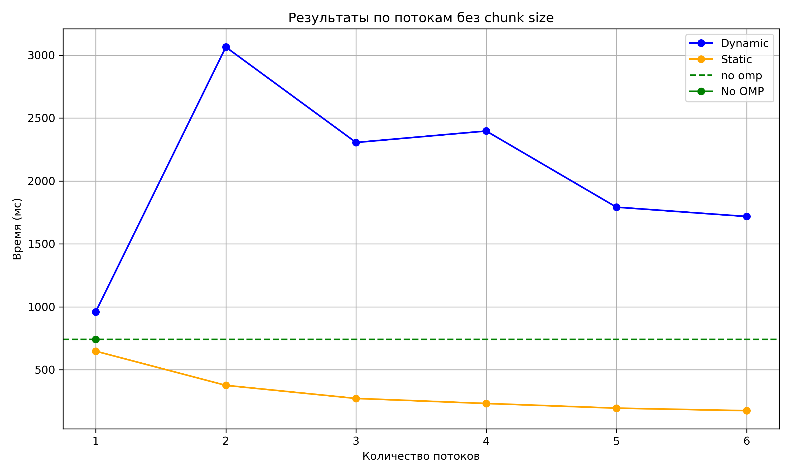               |
>|:-----------------------------------------------------------------------------:|
>| *Рис. 1. Время выполнения от числа потоков. Без chunk_size, Xor Shift Random* |

| XOR SHIFT RANDOM | Dynamic            | Static             |
|------------------|--------------------|--------------------|
| threads=1        | 616.1506799999999  | 608.1179800000003  |                   
| threads=2        | 311.30982          | 306.94826000000006 |                   
| threads=3        | 213.46932000000007 | 212.34223999999986 |                   
| threads=4        | 174.02857999999992 | 173.56111999999996 |
| threads=5        | 146.30154000000002 | 148.56091000000004 |                   
| threads=6        | 132.39290000000003 | 129.79215          |                   

> |                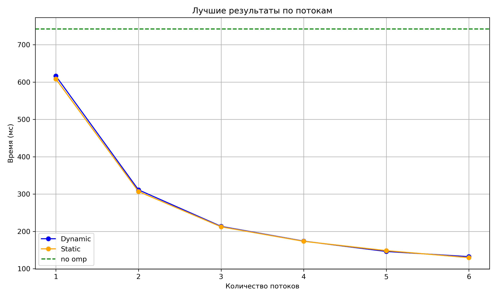                |
>|:--------------------------------------------------------------------------------:|
>| *Рис. 2. Время выполнения от числа потоков. Лучший chunk_size, Xor Shift Random* |

| XOR SHIFT RANDOM           | Dynamic           | Static            | no omp            |
|----------------------------|-------------------|-------------------|-------------------|
|                            |                   |                   | 742.1273400000001 |  
| threads=1 chunk_size=0     | 959.1870700000001 | 647.5335600000001 |                   |
| threads=1 chunk_size=1     | 977.4376000000001 | 738.4600399999997 |                   |
| threads=1 chunk_size=2     | 798.97356         | 693.8203500000001 |                   |
| threads=1 chunk_size=4     | 706.7744299999999 | 667.9802800000001 |                   |
| threads=1 chunk_size=8     | 662.3845100000002 | 669.9193300000001 |                   |
| threads=1 chunk_size=16    | 656.89602         | 671.99949         |                   |
| threads=1 chunk_size=1024  | 616.1506799999999 | 608.1179800000003 |                   |
| threads=1 chunk_size=65536 | 616.2857799999998 | 607.48229         |                   |

> |                       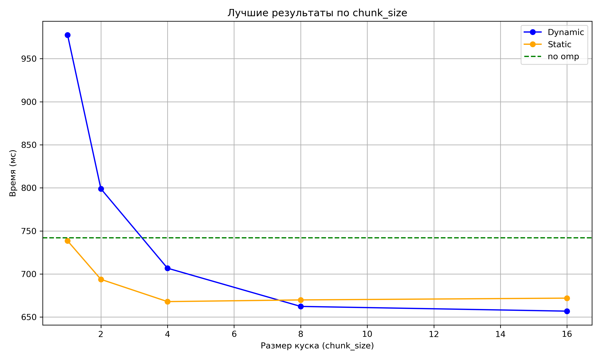                       |
>|:----------------------------------------------------------------------------------------------:|
>| *Рис. 3. Время выполнения с отключённым OpenMP и с включённым одним потоком, Xor Shift Random* |

> |                       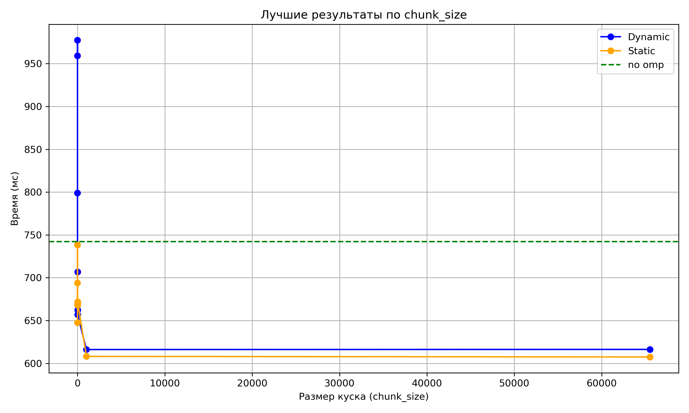                       |
>|:----------------------------------------------------------------------------------------------:|
>| *Рис. 4. Время выполнения с отключённым OpenMP и с включённым одним потоком, Xor Shift Random* |

| XOR SHIFT RANDOM | Dynamic            | Static    | no omp            |
|------------------|--------------------|-----------|-------------------|
| *                | *                  | *         | 742.1273400000001 |
| *                | 132.39290000000003 | *         | *                 |
| *                | *                  | 129.79215 | *                 |

**Время выполнения в лучшей конфигурации, Xor Shift Random**

### LCG

| LCG                        | Dynamic            | Static             | no omp             |
|----------------------------|--------------------|--------------------|--------------------|
|                            |                    |                    | 320.21758999999986 |
| threads=1 chunk_size=0     | 720.32038          | 363.2665499999998  |                    |        
| threads=1 chunk_size=1     | 721.4270099999999  | 438.8332000000001  |                    |
| threads=1 chunk_size=2     | 529.3780300000002  | 401.88604          |                    |
| threads=1 chunk_size=4     | 434.1517700000001  | 381.61602000000005 |                    |
| threads=1 chunk_size=8     | 399.45808000000005 | 372.3880299999999  |                    |
| threads=1 chunk_size=16    | 376.54825000000005 | 368.36753          |                    |
| threads=1 chunk_size=1024  | 357.08664          | 363.04133          |                    |
| threads=1 chunk_size=65536 | 360.12431999999995 | 363.7118000000001  |                    |
| threads=2 chunk_size=0     | 2471.1630000000005 | 208.9217299999999  |                    |
| threads=2 chunk_size=1     | 2575.7833999999993 | 208.93125000000003 |                    |
| threads=2 chunk_size=2     | 1221.4701699999996 | 188.90817000000004 |                    |
| threads=2 chunk_size=4     | 797.6244300000002  | 182.03506999999993 |                    |
| threads=2 chunk_size=8     | 567.7238500000002  | 169.82162          |                    |
| threads=2 chunk_size=16    | 431.08428999999984 | 175.37787000000003 |                    |
| threads=2 chunk_size=1024  | 186.0359300000001  | 168.70204          |                    |
| threads=2 chunk_size=65536 | 184.91643999999997 | 166.0188900000001  |                    |
| threads=3 chunk_size=0     | 2224.300499999999  | 120.28897999999995 |                    |
| threads=3 chunk_size=1     | 2201.985899999999  | 150.89968999999996 |                    |
| threads=3 chunk_size=2     | 1230.0265000000002 | 132.64675          |                    |
| threads=3 chunk_size=4     | 750.6885999999998  | 125.04092999999997 |                    |
| threads=3 chunk_size=8     | 499.1914499999998  | 122.43509999999993 |                    |
| threads=3 chunk_size=16    | 287.27097          | 119.50589000000005 |                    |
| threads=3 chunk_size=1024  | 130.20472999999998 | 120.94409          |                    |
| threads=3 chunk_size=65536 | 127.81734999999995 | 121.37797999999995 |                    |
| threads=4 chunk_size=0     | 2485.205099999999  | 101.20989799999998 |                    |
| threads=4 chunk_size=1     | 2538.766599999999  | 122.02588          |                    |
| threads=4 chunk_size=2     | 1359.5470999999995 | 111.48121799999998 |                    |
| threads=4 chunk_size=4     | 743.9374599999999  | 106.04796499999999 |                    |
| threads=4 chunk_size=8     | 450.92199          | 104.52965400000001 |                    |
| threads=4 chunk_size=16    | 262.336            | 102.01833800000003 |                    |
| threads=4 chunk_size=1024  | 141.11465000000007 | 101.10425599999995 |                    |
| threads=4 chunk_size=65536 | 138.87098999999995 | 100.127789         |                    |
| threads=5 chunk_size=0     | 1900.0151999999998 | 86.25729800000003  |                    |
| threads=5 chunk_size=1     | 1905.2843000000005 | 104.41016199999996 |                    |
| threads=5 chunk_size=2     | 1002.7346199999998 | 95.590499          |                    |
| threads=5 chunk_size=4     | 677.9435499999998  | 90.91517100000003  |                    |
| threads=5 chunk_size=8     | 392.9684800000003  | 88.73768799999999  |                    |
| threads=5 chunk_size=16    | 240.95204999999996 | 87.66330700000005  |                    |
| threads=5 chunk_size=1024  | 116.69940699999998 | 88.02471699999998  |                    |
| threads=5 chunk_size=65536 | 116.467575         | 86.61003499999998  |                    |
| threads=6 chunk_size=0     | 1883.1092000000003 | 75.05852899999995  |                    |
| threads=6 chunk_size=1     | 1887.4066999999998 | 100.74184199999998 |                    |
| threads=6 chunk_size=2     | 1011.23479         | 89.44294300000001  |                    |
| threads=6 chunk_size=4     | 612.3865099999997  | 83.60841299999998  |                    |
| threads=6 chunk_size=8     | 328.4400100000001  | 81.92129200000001  |                    |
| threads=6 chunk_size=16    | 224.26999          | 79.43605899999997  |                    |
| threads=6 chunk_size=1024  | 99.36119700000003  | 80.245992          |                    |
| threads=6 chunk_size=65536 | 105.26176199999998 | 81.105628          |                    |

| LCG                    | Dynamic            | Static             | no omp             |
|------------------------|--------------------|--------------------|--------------------|
|                        |                    |                    | 320.21758999999986 |
| threads=1 chunk_size=0 | 720.32038          | 363.2665499999998  |                    |        
| threads=2 chunk_size=0 | 2471.1630000000005 | 208.9217299999999  |                    |
| threads=3 chunk_size=0 | 2224.300499999999  | 120.28897999999995 |                    |
| threads=4 chunk_size=0 | 2485.205099999999  | 101.20989799999998 |                    |
| threads=5 chunk_size=0 | 1900.0151999999998 | 86.25729800000003  |                    |
| threads=6 chunk_size=0 | 1883.1092000000003 | 75.05852899999995  |                    |

> |              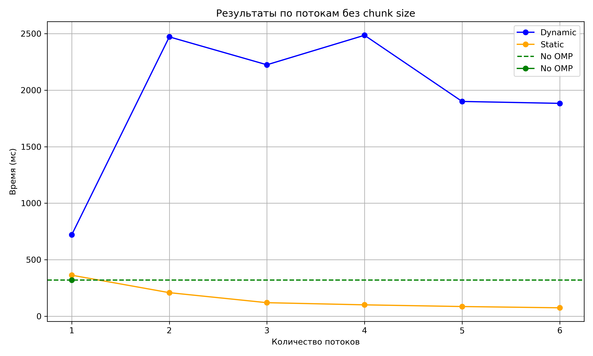              |
>|:----------------------------------------------------------------:|
>| *Рис. 5. Время выполнения от числа потоков. Без chunk_size, LCG* |

| LCG       | Dynamic            | Static             | no omp             |
|-----------|--------------------|--------------------|--------------------|
|           |                    |                    | 320.21758999999986 |
| threads=1 | 357.08664          | 363.04133          |                    |
| threads=2 | 184.91643999999997 | 166.0188900000001  |                    |
| threads=3 | 127.81734999999995 | 119.50589000000005 |                    |
| threads=4 | 138.87098999999995 | 100.127789         |                    |
| threads=5 | 116.467575         | 86.25729800000003  |                    |
| threads=6 | 99.36119700000003  | 75.05852899999995  |                    |

> |               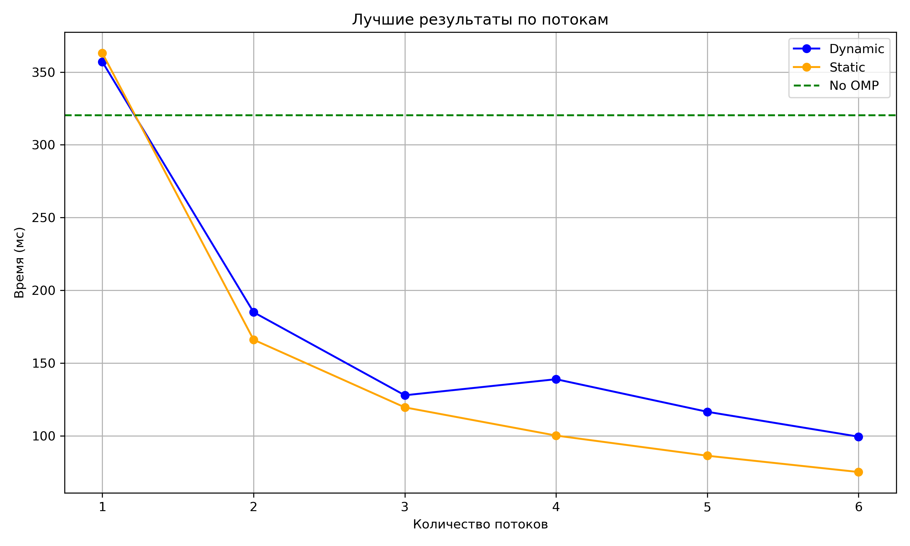                |
>|:-------------------------------------------------------------------:|
>| *Рис. 6. Время выполнения от числа потоков. Лучший chunk_size, LCG* |

| LCG                        | Dynamic            | Static             | no omp             |
|----------------------------|--------------------|--------------------|--------------------|
|                            |                    |                    | 320.21758999999986 |
| threads=1 chunk_size=0     | 720.32038          | 363.2665499999998  |                    |        
| threads=1 chunk_size=1     | 721.4270099999999  | 438.8332000000001  |                    |
| threads=1 chunk_size=2     | 529.3780300000002  | 401.88604          |                    |
| threads=1 chunk_size=4     | 434.1517700000001  | 381.61602000000005 |                    |
| threads=1 chunk_size=8     | 399.45808000000005 | 372.3880299999999  |                    |
| threads=1 chunk_size=16    | 376.54825000000005 | 368.36753          |                    |
| threads=1 chunk_size=1024  | 357.08664          | 363.04133          |                    |
| threads=1 chunk_size=65536 | 360.12431999999995 | 363.7118000000001  |                    |

> |                      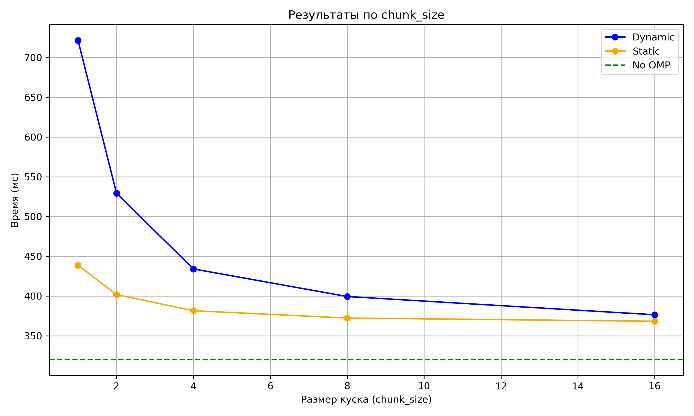                       |
>|:---------------------------------------------------------------------------------:|
>| *Рис. 7. Время выполнения с отключённым OpenMP и с включённым одним потоком, LCG* |

> |                      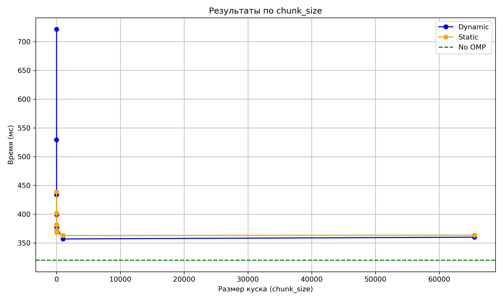                       |
>|:---------------------------------------------------------------------------------:|
>| *Рис. 8. Время выполнения с отключённым OpenMP и с включённым одним потоком, LCG* |

| LCG | Dynamic           | Static            | no omp             |
|-----|-------------------|-------------------|--------------------|
| *   | *                 | *                 | 320.21758999999986 |
| *   | 99.36119700000003 | *                 | *                  |
| *   | *                 | 75.05852899999995 | *                  |

**Время выполнения в лучшей конфигурации, LCG**

### Mersenne

| MERSENNE                   | Dynamic            | Static             | no omp    |
|----------------------------|--------------------|--------------------|-----------|
|                            |                    |                    | 956.23506 |
| threads=1 chunk_size=0     | 1459.2138000000004 | 979.6839999999996  |           | 
| threads=1 chunk_size=1     | 1457.8219000000004 | 1155.4581000000005 |           | 
| threads=1 chunk_size=2     | 1228.0756          | 1038.6444999999994 |           | 
| threads=1 chunk_size=4     | 1094.0227          | 1002.3167000000001 |           | 
| threads=1 chunk_size=8     | 1038.6502          | 991.3661299999997  |           | 
| threads=1 chunk_size=16    | 1012.1187000000001 | 983.51205          |           | 
| threads=1 chunk_size=1024  | 981.8386800000001  | 977.4677800000002  |           | 
| threads=1 chunk_size=65536 | 980.7897299999997  | 977.4954800000005  |           | 
| threads=2 chunk_size=0     | 2454.2849          | 491.3553899999998  |           | 
| threads=2 chunk_size=1     | 2528.3521000000005 | 579.8482200000001  |           | 
| threads=2 chunk_size=2     | 1112.3551          | 519.2280599999999  |           | 
| threads=2 chunk_size=4     | 896.71071          | 506.45614          |           | 
| threads=2 chunk_size=8     | 878.1847200000001  | 510.72994000000006 |           | 
| threads=2 chunk_size=16    | 667.4337100000001  | 498.85919          |           | 
| threads=2 chunk_size=1024  | 497.7303399999999  | 493.83408000000003 |           | 
| threads=2 chunk_size=65536 | 496.75344999999993 | 491.04488          |           | 
| threads=3 chunk_size=0     | 2324.007899999999  | 333.45305          |           | 
| threads=3 chunk_size=1     | 2309.6744444444444 | 389.06447999999983 |           | 
| threads=3 chunk_size=2     | 1360.4386000000002 | 360.83767000000006 |           | 
| threads=3 chunk_size=4     | 893.5689899999999  | 359.1863900000001  |           | 
| threads=3 chunk_size=8     | 594.2066099999998  | 340.91036999999983 |           | 
| threads=3 chunk_size=16    | 443.92572          | 336.71448          |           | 
| threads=3 chunk_size=1024  | 336.041            | 333.66865000000007 |           | 
| threads=3 chunk_size=65536 | 333.34274000000005 | 331.6086           |           | 
| threads=4 chunk_size=0     | 2427.310400000001  | 269.15664999999996 |           | 
| threads=4 chunk_size=1     | 2428.913600000001  | 317.30904999999996 |           | 
| threads=4 chunk_size=2     | 1388.6960000000004 | 279.70716          |           | 
| threads=4 chunk_size=4     | 810.2486000000001  | 277.3220599999999  |           | 
| threads=4 chunk_size=8     | 505.85546          | 275.49273999999997 |           | 
| threads=4 chunk_size=16    | 354.39224          | 271.93818000000016 |           | 
| threads=4 chunk_size=1024  | 266.44991999999996 | 267.71892          |           | 
| threads=4 chunk_size=65536 | 334.1695           | 268.95080999999993 |           |
| threads=5 chunk_size=0     | 2072.469200000001  | 228.36536          |           | 
| threads=5 chunk_size=1     | 2090.6867999999995 | 258.4376400000001  |           | 
| threads=5 chunk_size=2     | 1144.2234999999996 | 238.52624          |           | 
| threads=5 chunk_size=4     | 708.6009300000001  | 235.39597          |           | 
| threads=5 chunk_size=8     | 400.67623          | 233.64247000000006 |           | 
| threads=5 chunk_size=16    | 299.5613299999999  | 228.9460399999999  |           | 
| threads=5 chunk_size=1024  | 225.77935999999997 | 228.24191999999988 |           | 
| threads=5 chunk_size=65536 | 226.09871000000007 | 228.16843          |           | 
| threads=6 chunk_size=0     | 1770.0350999999998 | 198.31024000000005 |           | 
| threads=6 chunk_size=1     | 1787.8928999999991 | 230.82468          |           | 
| threads=6 chunk_size=2     | 1042.1054999999997 | 214.63073000000003 |           | 
| threads=6 chunk_size=4     | 641.47724          | 217.35527000000005 |           | 
| threads=6 chunk_size=8     | 353.3799500000001  | 202.06297000000006 |           | 
| threads=6 chunk_size=16    | 264.3303200000001  | 201.3278           |           | 
| threads=6 chunk_size=1024  | 204.2944299999999  | 209.72317999999984 |           | 
| threads=6 chunk_size=65536 | 205.00369000000012 | 208.20205000000013 |           | 

| MERSENNE               | Dynamic            | Static             | no omp    |
|------------------------|--------------------|--------------------|-----------|
|                        |                    |                    | 956.23506 |
| threads=1 chunk_size=0 | 1459.2138000000004 | 979.6839999999996  |           | 
| threads=2 chunk_size=0 | 2454.2849          | 491.3553899999998  |           | 
| threads=3 chunk_size=0 | 2324.007899999999  | 333.45305          |           | 
| threads=4 chunk_size=0 | 2427.310400000001  | 269.15664999999996 |           | 
| threads=5 chunk_size=0 | 2072.469200000001  | 228.36536          |           | 
| threads=6 chunk_size=0 | 1770.0350999999998 | 198.31024000000005 |           |

> |              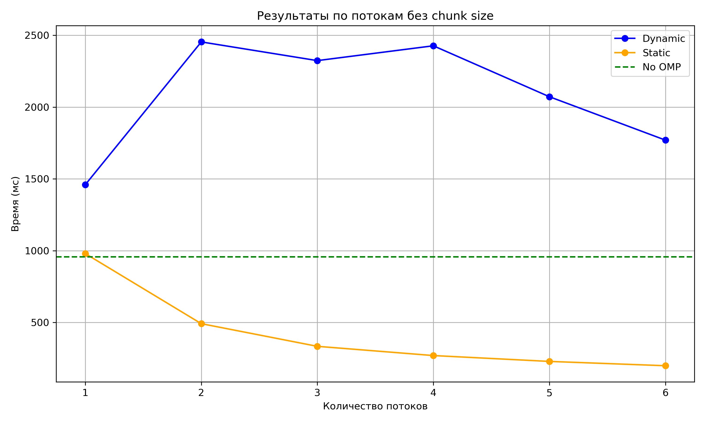              |
>|:---------------------------------------------------------------------:|
>| *Рис. 9. Время выполнения от числа потоков. Без chunk_size, Mersenne* |

| MERSENNE  | Dynamic            | Static             | no omp    |
|-----------|--------------------|--------------------|-----------|
|           |                    |                    | 956.23506 |
| threads=1 | 980.7897299999997  | 977.4954800000005  |           |
| threads=2 | 496.75344999999993 | 491.04488          |           |
| threads=3 | 333.34274000000005 | 331.6086           |           |
| threads=4 | 266.44991999999996 | 267.71892          |           | 
| threads=5 | 225.77935999999997 | 228.16843          |           |
| threads=6 | 204.2944299999999  | 198.31024000000005 |           | 

> |            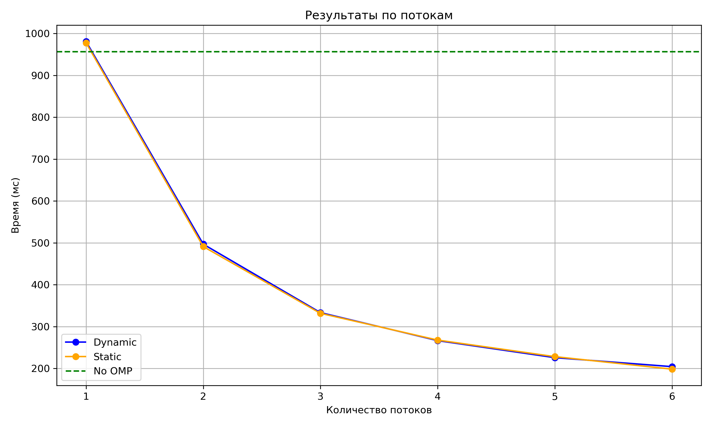             |
>|:-------------------------------------------------------------------------:|
>| *Рис. 10. Время выполнения от числа потоков. Лучший chunk_size, Mersenne* |

| MERSENNE                   | Dynamic            | Static             | no omp    |
|----------------------------|--------------------|--------------------|-----------|
|                            |                    |                    | 956.23506 |
| threads=1 chunk_size=0     | 1459.2138000000004 | 979.6839999999996  |           | 
| threads=1 chunk_size=1     | 1457.8219000000004 | 1155.4581000000005 |           | 
| threads=1 chunk_size=2     | 1228.0756          | 1038.6444999999994 |           | 
| threads=1 chunk_size=4     | 1094.0227          | 1002.3167000000001 |           | 
| threads=1 chunk_size=8     | 1038.6502          | 991.3661299999997  |           | 
| threads=1 chunk_size=16    | 1012.1187000000001 | 983.51205          |           | 
| threads=1 chunk_size=1024  | 981.8386800000001  | 977.4677800000002  |           | 
| threads=1 chunk_size=65536 | 980.7897299999997  | 977.4954800000005  |           |

> |                   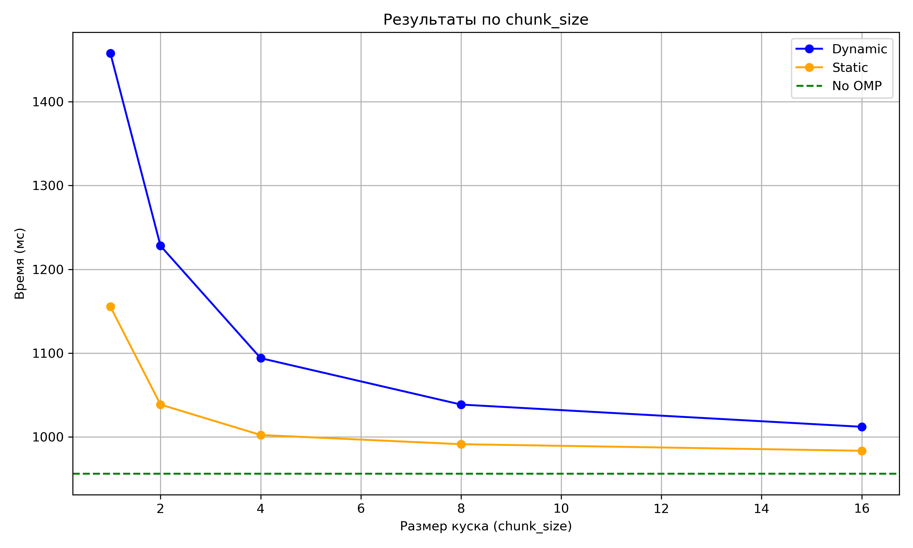                    |
>|:---------------------------------------------------------------------------------------:|
>| *Рис. 11. Время выполнения с отключённым OpenMP и с включённым одним потоком, Mersenne* | 


> |                   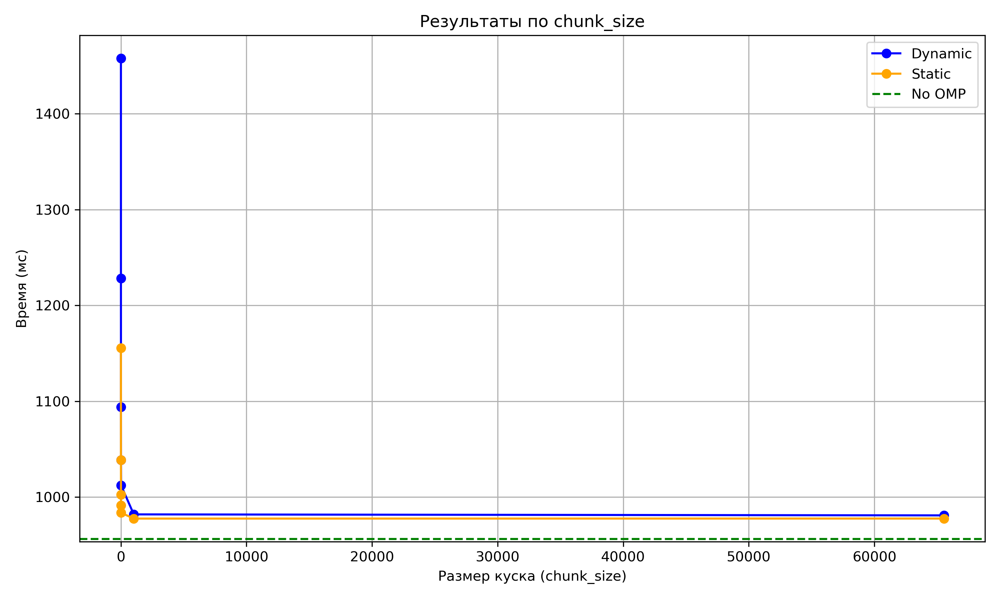                    |
>|:---------------------------------------------------------------------------------------:|
>| *Рис. 12. Время выполнения с отключённым OpenMP и с включённым одним потоком, Mersenne* | 

| MERSENNE | Dynamic           | Static             | no omp    |
|----------|-------------------|--------------------|-----------|
|          |                   |                    | 956.23506 |
| *        | *                 | 198.31024000000005 |           | 
| *        | 204.2944299999999 | *                  |           | 

Как и ожидалось, static в целом показал лучшие результаты, поскольку он не тратит время на
распределение вычислений между потоками - каждому потоку выделено заранее известное количество.
Поскольку операции в цикле однотипные, это оптимальный способ. Но как я уже упоминала, это верно
не абсолютно всегда, в ином случае может быть лучше dynamic

Также, как и ожидалось из документации Oracle, по графикам можно видеть, что увеличение chunk_size
ускоряет программу. Уменьшение false sharing - это хорошо
> В других случаях изменение отображения итераций на потоки, предоставление
> каждому потоку большего объема работы на чанк (путем изменения значения chunksize)
> также может привести к уменьшению false sharing.
>
> [Документация Oracle "Reducing False Sharing"](https://docs.oracle.com/cd/E19205-01/819-5270/aewcz/index.html)

В начале графика при малых потоках и малых chunk_size можно видеть, что многопоточные
программы отработали плохо: это связано с накладными расходами на управление задачами
в потоках. Далее можно видеть, что между 1024 и 65536 чанками изменения уже несущественные и
оптимум, как правило, достигается при максимальном числе потоков

По табличным данным также можно заметить, что в случае static отсутствие указания чанков
показывает хорошие результаты по сравнению с указанием небольшого количества чанков. Это
связано с тем что static по умолчанию ставит размер не 1, а число итераций цикла,
деленное на количество потоков, примененных к циклу. В то время как для dynamic
есть чёткая взаимосвязь: больше чанков - лучше, поскольку у него размер по умолчанию 1

Если сравнивать генераторы, то их можно расставить по скорости:

1. LCG
2. Xor Shift Random
3. Mersenne

Это связано с тем что LCG содержит минимум вычислений, Xor Shift Random чуть побольше, но
кроме цикла на 19 итераций и побитовых сдвигов в нём ничего нет, а Mersenne вызывает библиотечные
функции, что долго

## Лучший усреднённый результат 75 мс при static, threads=6, без chunk_size

При указанном количестве чанков минимальный результат 80 мс, что довольно близко
